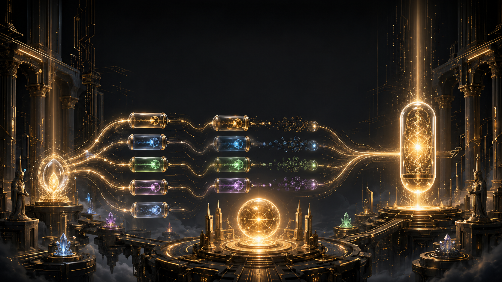
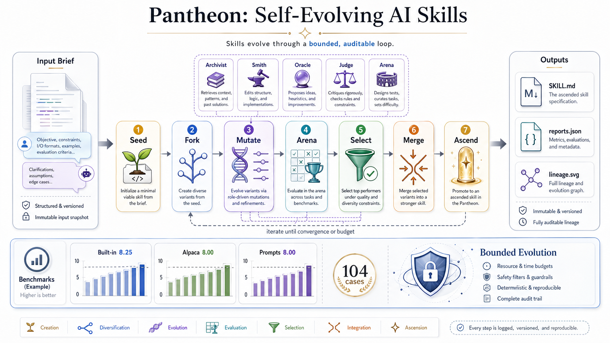
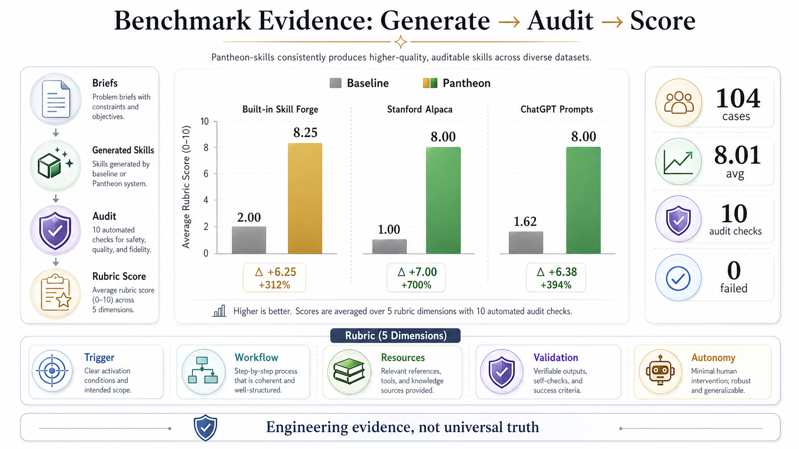

<p align="center">
  
</p>

<h1 align="center">Pantheon / 万神殿</h1>

<p align="center">
  <strong>An evolution chamber for Codex skills: fork, mutate, score, select, merge, and preserve lineage.</strong>
</p>

<p align="center">
  <a href="README.md"></a>
  <a href="README.zh-CN.md"></a>
</p>

<p align="center">
  <a href="pantheon/SKILL.md"></a>
  <a href="pantheon/references/evolution-protocol.md"></a>
  <a href="pantheon/reports/alpaca-50.json"></a>
  <a href="pantheon/reports/prompts-50.json"></a>
  <a href="pantheon/reports/evolution-demo.json"></a>
  <a href="pantheon/references/language-policy.md"></a>
</p>

---

<table>
  <tr>
    <td><strong>Fork</strong><br>Split one workflow into multiple skill variants.</td>
    <td><strong>Mutate</strong><br>Apply different cognitive strategies to each variant.</td>
    <td><strong>Ascend</strong><br>Select winners, merge traits, and preserve lineage.</td>
  </tr>
</table>

## The Pitch

Most AI workflows die in chat history. Most "self-improving" agents are just prompts with ambition.

Pantheon treats skills like digital organisms. A workflow can be copied, mutated into competing variants, scored in an arena, selected, merged, and recorded as lineage.

That is the real connection to *Pantheon*: uploaded intelligence does not surpass humans by remembering more. It surpasses humans by escaping human limits: speed, copying, parallel trial, merge, simulation, and durable memory.

> Not a skill library. Not a prompt dump. Not silent self-modification.
>
> Pantheon is an evolution chamber for AI skills.

## Why It Matters

AI agents repeat themselves constantly:

- rediscovering the same project conventions
- forgetting the same validation steps
- rewriting the same boilerplate
- losing hard-won debugging knowledge
- producing "helpful" instructions that cannot be tested

Pantheon gives those lessons a body.

<p align="center">
  
  
  
  
</p>

<p align="center">
  
</p>

## What Pantheon Does

<table>
  <tr>
    <th>Module</th>
    <th>Capability</th>
    <th>What it means</th>
  </tr>
  <tr>
    <td></td>
    <td>Variant forking</td>
    <td>Split one seed workflow into multiple candidate skill variants.</td>
  </tr>
  <tr>
    <td></td>
    <td>Mutation profiles</td>
    <td>Apply Archivist, Smith, Oracle, Judge, and Arena strategies.</td>
  </tr>
  <tr>
    <td></td>
    <td>Arena scoring</td>
    <td>Measure trigger clarity, workflow leverage, resources, validation, and autonomy boundaries.</td>
  </tr>
  <tr>
    <td></td>
    <td>Selection</td>
    <td>Keep the strongest audited variants and reject weak mutations.</td>
  </tr>
  <tr>
    <td></td>
    <td>Ascension</td>
    <td>Merge winning traits into an ascended skill and write a lineage report.</td>
  </tr>
  <tr>
    <td></td>
    <td>Memory preservation</td>
    <td>Save reports, charts, and rollback context so the next evolution starts from evidence.</td>
  </tr>
</table>

## Results

Pantheon includes repeatable benchmark reports, not just screenshots and vibes.

<p align="center">
  
</p>

<table>
  <tr>
    <th>Benchmark</th>
    <th>Cases</th>
    <th>Baseline Avg</th>
    <th>Pantheon Avg</th>
    <th>Lift</th>
  </tr>
  <tr>
    <td>Built-in skill forge cases</td>
    <td align="right">4</td>
    <td align="right">2.00 / 10</td>
    <td align="right"><strong>8.25 / 10</strong></td>
    <td></td>
  </tr>
  <tr>
    <td>Stanford Alpaca sample</td>
    <td align="right">50</td>
    <td align="right">1.00 / 10</td>
    <td align="right"><strong>8.00 / 10</strong></td>
    <td></td>
  </tr>
  <tr>
    <td>awesome-chatgpt-prompts sample</td>
    <td align="right">50</td>
    <td align="right">1.62 / 10</td>
    <td align="right"><strong>8.00 / 10</strong></td>
    <td></td>
  </tr>
</table>

Validation:

```text
Pantheon audit: 10 passed, 0 failed
Codex quick_validate: Skill is valid
Skill-forge experiment: 9 passed, 0 failed
```

Reports:

- [pantheon/reports/alpaca-50.json](pantheon/reports/alpaca-50.json)
- [pantheon/reports/prompts-50.json](pantheon/reports/prompts-50.json)
- [pantheon/reports/evolution-demo.json](pantheon/reports/evolution-demo.json)

These scores are engineering evidence, not a universal quality claim. The point is that the system has a proof loop: generate, audit, fail, revise, benchmark.

## Quick Start

```bash
python3 pantheon/scripts/pantheon.py audit pantheon
python3 pantheon/scripts/pantheon.py distill --input pantheon/experiments/skill-forge-basic.md
python3 pantheon/scripts/pantheon.py evolve --brief pantheon/experiments/skill-forge-basic.md --report pantheon/reports/evolution-demo.json
python3 pantheon/scripts/pantheon.py experiment --case pantheon/experiments/skill-forge-basic.md --workdir /tmp/pantheon-exp
python3 pantheon/scripts/pantheon.py benchmark --dataset pantheon/experiments/pantheon-benchmark.jsonl --workdir /tmp/pantheon-bench
```

Run public dataset samples:

```bash
python3 pantheon/scripts/pantheon.py benchmark-public --name alpaca --limit 50 --report pantheon/reports/alpaca-50.json
python3 pantheon/scripts/pantheon.py benchmark-public --name awesome-chatgpt-prompts --limit 50 --report pantheon/reports/prompts-50.json
```

## Use It As A Codex Skill

Install locally by symlinking the skill directory:

```bash
ln -s "$PWD/pantheon" "${CODEX_HOME:-$HOME/.codex}/skills/pantheon"
```

Then invoke it:

```text
Use $pantheon to turn this repeated workflow into a validated Codex skill.
```

Chinese works too:

```text
使用 $pantheon，把这个重复工作流沉淀成一个经过验证的 Codex skill。
```

## Project Layout

```text
pantheon/
├── SKILL.md
├── agents/openai.yaml
├── assets/
│   ├── benchmark-evidence.png
│   ├── evolution-loop.png
│   ├── pantheon-hero.png
│   └── pantheon-mark.svg
├── experiments/
│   ├── pantheon-benchmark.jsonl
│   └── skill-forge-basic.md
├── references/
│   ├── evolution-protocol.md
│   ├── experiment-rubric.md
│   └── language-policy.md
├── reports/
│   ├── alpaca-50.json
│   ├── builtin-4.json
│   ├── evolution-demo.json
│   └── prompts-50.json
└── scripts/pantheon.py
```

## The Safety Model

Pantheon is designed to evolve skills without pretending that autonomy is free.

It may:

- propose evolutions
- generate patches
- run audits and benchmarks
- produce installable skill drafts

It must not:

- replace installed skills without confirmation
- claim validation that did not run
- hide destructive changes behind mythic language
- treat benchmark scores as proof of universal quality

## Roadmap

- Larger public benchmark adapters
- Human preference review for generated skill drafts
- Cross-language skill quality checks
- Regression tests for skill evolution
- A gallery of generated "deity" skills for common agent workflows

## The Manifesto

Every team has invisible rituals.

The commands people remember. The checks they run before shipping. The weird bug they only fixed once. The review comment that taught them how the system really works.

Pantheon is a place to preserve those rituals without freezing them. Skills can evolve, but only under witness. Memory can become executable, but it must remain accountable.

Keep the human memory.

Make it operational.

## How To Cite

If Pantheon helps your work, cite the repository directly:

```bibtex
@software{pantheon_skills_2026,
  title = {Pantheon-skills: A self-evolving Pantheon for AI skills},
  author = {He, Jwei},
  year = {2026},
  url = {https://github.com/jweihe/Pantheon-skills},
  note = {An evolution chamber for Codex skills: fork, mutate, benchmark, and ascend executable memory}
}
```

This repository also includes [CITATION.cff](CITATION.cff) for citation tools.

## References

- [Pantheon TV series](https://en.wikipedia.org/wiki/Pantheon_(TV_series))
- [Stanford Alpaca dataset](https://github.com/tatsu-lab/stanford_alpaca)
- [awesome-chatgpt-prompts dataset](https://github.com/f/awesome-chatgpt-prompts)
- [Codex skill definition](pantheon/SKILL.md)
- [Evolution protocol](pantheon/references/evolution-protocol.md)
- [Experiment rubric](pantheon/references/experiment-rubric.md)
- [Language policy](pantheon/references/language-policy.md)
- [Evolution report](pantheon/reports/evolution-demo.json)
