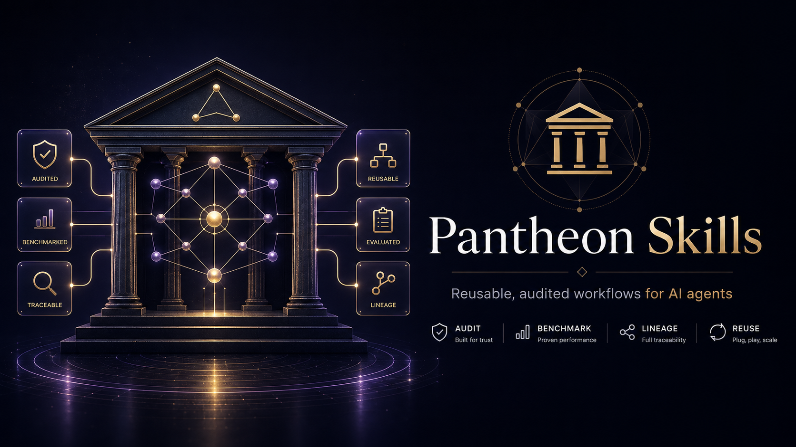

<p align="center">
  
</p>

<p align="center">
  <a href="https://github.com/jweihe/Pantheon-skills/actions/workflows/ci.yml"></a>
  <a href="pantheon/SKILL.md"></a>
  
  <a href="README.zh-CN.md"></a>
</p>

Pantheon Skills is a framework for evolving repeated AI-agent workflows into reusable Codex skills.

If you keep telling an agent the same rules, checks, scripts, or project habits, Pantheon helps you turn that repeated knowledge into a skill, then audit and benchmark it before you install it.

It is not a prompt collection. It is a skill evolution loop: seed, fork, mutate, score, select, merge, and preserve lineage.

## What Problem Does It Solve?

AI agents forget useful workflow knowledge:

- the commands you always run before shipping
- the review checklist you repeat every time
- the project conventions that are not obvious from code
- the debugging steps you learned the hard way
- the safety boundaries you do not want the agent to cross

Pantheon turns that knowledge into a `SKILL.md` plus references, scripts, and validation reports.

## Concrete Example

Input brief:

```text
Every time we build a small frontend tool, we forget the same checks:
responsive layout, no overlapping text, realistic sample data, and a final screenshot review.
Turn this into a reusable Codex skill.
```

Pantheon can turn that into:

```text
frontend-tool-builder/
├── SKILL.md
├── agents/openai.yaml
└── references/checklist.md
```

Then it can audit the skill and compare it against a naive generated skill on repeatable benchmark cases.

## Skill Evolution

Pantheon starts from a seed workflow and creates several competing skill variants. Each variant emphasizes a different strategy:

- **Archivist**: preserve durable project memory
- **Smith**: turn repeat work into scripts, references, and structure
- **Oracle**: improve trigger clarity and language fit
- **Judge**: harden validation and safety boundaries
- **Arena**: optimize for repeatable benchmark performance

The variants are scored in the same arena. The strongest ones are selected and merged into an ascended skill. The process leaves a lineage report, so the next iteration starts from evidence instead of vibes.

## 60-Second Demo

Clone the repo and run the built-in checks:

```bash
git clone https://github.com/jweihe/Pantheon-skills.git
cd Pantheon-skills
make audit
make demo
```

No package install is required. The core tool uses the Python standard library.

Expected result:

```text
Pantheon audit: 10 passed, 0 failed
Skill-forge experiment: 9 passed, 0 failed
```

## Common Workflows

### 1. Audit the Pantheon skill itself

```bash
python3 pantheon/scripts/pantheon.py audit pantheon
```

### 2. Turn a brief into a draft skill

```bash
python3 pantheon/scripts/pantheon.py scaffold \
  --brief pantheon/experiments/skill-forge-basic.md \
  --out /tmp/pantheon-skills
```

### 3. Run a full demo experiment

```bash
python3 pantheon/scripts/pantheon.py experiment \
  --case pantheon/experiments/skill-forge-basic.md \
  --workdir /tmp/pantheon-exp
```

### 4. Compare a naive skill against a Pantheon-generated skill

```bash
python3 pantheon/scripts/pantheon.py benchmark \
  --dataset pantheon/experiments/pantheon-benchmark.jsonl \
  --workdir /tmp/pantheon-bench
```

### 5. Run the evolution loop

```bash
python3 pantheon/scripts/pantheon.py evolve \
  --brief pantheon/experiments/skill-forge-basic.md \
  --workdir /tmp/pantheon-evolve \
  --report /tmp/pantheon-evolve/report.json \
  --svg /tmp/pantheon-evolve/lineage.svg
```

## Install As A Codex Skill

Symlink the `pantheon/` folder into your Codex skills directory:

```bash
mkdir -p "${CODEX_HOME:-$HOME/.codex}/skills"
ln -s "$PWD/pantheon" "${CODEX_HOME:-$HOME/.codex}/skills/pantheon"
```

Then ask Codex:

```text
Use $pantheon to turn this repeated workflow into a validated Codex skill.
```

Chinese also works:

```text
使用 $pantheon，把这个重复工作流沉淀成一个经过验证的 Codex skill。
```

## Why Is It Called Pantheon?

The name is inspired by the TV series *Pantheon*.

The interesting idea is not that digital intelligence remembers more. It is that digital intelligence can copy itself, fork into variants, run parallel trials, merge what worked, and keep durable memory across generations.

Pantheon applies that idea to AI-agent skills:

- a workflow becomes a seed skill
- the seed forks into multiple variants
- variants mutate around different strengths
- an arena scores them on repeatable cases
- winners are merged into a stronger skill
- lineage is preserved for the next evolution

This is still bounded engineering, not silent self-modification. Pantheon should generate, audit, benchmark, and propose skill evolution. It should not secretly replace installed skills.

## Brand Asset

Use [pantheon/assets/pantheon-hero-gpt.png](pantheon/assets/pantheon-hero-gpt.png) as the main project hero or social preview.

## Commands

```bash
make audit       # audit pantheon/SKILL.md
make demo        # run scaffold-and-audit experiment
make benchmark   # run the local benchmark
make evolve      # run the evolution loop into /tmp
```

Direct CLI:

```bash
python3 pantheon/scripts/pantheon.py --help
```

Available subcommands:

- `distill`: summarize a workflow brief into a skill proposal
- `scaffold`: create a draft skill folder
- `audit`: validate a skill folder
- `experiment`: run a scaffold-and-audit demo
- `benchmark`: compare baseline vs Pantheon-generated skills
- `benchmark-public`: run supported public dataset samples
- `plot-reports`: render benchmark reports into SVG charts
- `evolve`: fork variants, score them, merge winners, and save lineage

## Current Evidence

Included reports:

- Built-in benchmark: 4 cases, Pantheon average 8.25 / 10
- Stanford Alpaca sample: 50 cases, Pantheon average 8.00 / 10
- awesome-chatgpt-prompts sample: 50 cases, Pantheon average 8.00 / 10

These are engineering smoke tests, not a claim that the system solves skill creation universally.

## Repository Layout

```text
pantheon/
├── SKILL.md
├── agents/openai.yaml
├── experiments/
├── references/
├── reports/
└── scripts/pantheon.py
```

## Safety Model

Pantheon can generate and test skill drafts. It should not silently replace installed skills.

Before installing or replacing a skill, review the diff and run:

```bash
python3 pantheon/scripts/pantheon.py audit path/to/skill
```

## Citation

```bibtex
@software{pantheon_skills_2026,
  title = {Pantheon-skills: A toolkit for creating and validating Codex skills},
  author = {He, Jwei},
  year = {2026},
  url = {https://github.com/jweihe/Pantheon-skills}
}
```

See [CITATION.cff](CITATION.cff) for citation tools.
