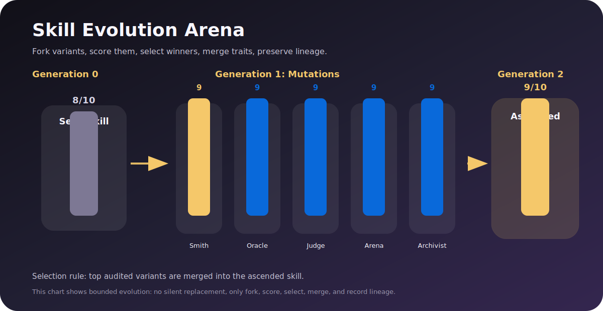
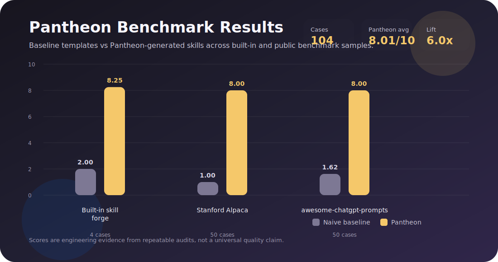

<p align="center">
  
</p>

<h1 align="center">Pantheon / 万神殿</h1>

<p align="center">
  <strong>不是技能库，而是 AI 技能的进化舱：分叉、变异、竞技、选择、融合、留下谱系。</strong>
</p>

<p align="center">
  <a href="README.md"></a>
  <a href="README.zh-CN.md"></a>
</p>

<p align="center">
  <a href="pantheon/SKILL.md"></a>
  <a href="pantheon/references/evolution-protocol.md"></a>
  <a href="pantheon/reports/alpaca-50.json"></a>
  <a href="pantheon/reports/prompts-50.json"></a>
  <a href="pantheon/reports/evolution-demo.json"></a>
</p>

---

<table>
  <tr>
    <td><strong>分叉</strong><br>一个工作流，生成多个 skill 候选。</td>
    <td><strong>变异</strong><br>让候选分别走不同策略路线。</td>
    <td><strong>飞升</strong><br>选出胜者，融合优点，保留谱系。</td>
  </tr>
</table>

## 它到底在做什么

之前的版本更像“把经验沉淀成 skill”。这有用，但还不够像《万神殿》。

《万神殿》真正震撼的地方，不是 AI 会背更多知识，而是数字意识突破了人的限制：它可以加速思考，可以复制自己并行试错，可以把失败经验合并回来，可以在模拟里跑大量实验，还能把记忆保存成不会自然消失的东西。

所以 Pantheon 现在的目标也变了：

```text
不是收集 skills。
而是让 skills 进化。
```

给它一个 brief，它会先生成一个种子 skill，然后分叉出多个变体：Archivist、Smith、Oracle、Judge、Arena。每个变体都带不同的“认知倾向”：有的擅长保存经验，有的擅长工具化，有的擅长触发条件，有的擅长安全边界，有的擅长 benchmark。

然后它们进入竞技场，被同一套规则评分。胜出的变体会被选择、融合，生成下一代 ascended skill，并留下 lineage report。

<p align="center">
  
</p>

## 为什么这比“写个 prompt”更重要

Prompt 是一次性的。  
经验如果只留在聊天记录里，下次还要重新讲。  
手写规范很容易过期。  
所谓“自进化 agent”如果没有审计和谱系，很快就会变成不可控的黑箱。

Pantheon 的思路是工程化的：

- 每次进化都要有输入 brief
- 每个变体都要落成真实 skill 目录
- 每个候选都要被同一套评分器审计
- 胜者为什么胜出要写进 report
- 合并后的版本不能偷偷替换已安装 skill
- 下一次进化要从谱系开始，而不是从感觉开始

这才接近“数字智能为什么能超越人类”：不是靠灵感，而是靠可复制、可并行、可验证、可继承的速度。

## 核心能力

<table>
  <tr>
    <th>模块</th>
    <th>能力</th>
    <th>说明</th>
  </tr>
  <tr>
    <td></td>
    <td>分叉</td>
    <td>从一个种子工作流生成多个候选 skill。</td>
  </tr>
  <tr>
    <td></td>
    <td>变异</td>
    <td>给候选注入不同策略：保存经验、工具化、审计、安全、语言适配。</td>
  </tr>
  <tr>
    <td></td>
    <td>竞技评分</td>
    <td>按触发清晰度、复用价值、资源设计、验证完整性、自治边界打分。</td>
  </tr>
  <tr>
    <td></td>
    <td>选择</td>
    <td>保留审计通过且分数更高的变体。</td>
  </tr>
  <tr>
    <td></td>
    <td>融合</td>
    <td>把胜者的强项合成 ascended skill。</td>
  </tr>
  <tr>
    <td></td>
    <td>谱系</td>
    <td>输出 JSON 报告和 SVG 图，记录每一代为什么变强。</td>
  </tr>
</table>

## 实验结果

现在不只是 12 条样本，而是跑了 104 个 case：

<p align="center">
  
</p>

<table>
  <tr>
    <th>Benchmark</th>
    <th>Cases</th>
    <th>Baseline Avg</th>
    <th>Pantheon Avg</th>
    <th>提升</th>
  </tr>
  <tr>
    <td>内置 skill forge 案例</td>
    <td align="right">4</td>
    <td align="right">2.00 / 10</td>
    <td align="right"><strong>8.25 / 10</strong></td>
    <td></td>
  </tr>
  <tr>
    <td>Stanford Alpaca 样本</td>
    <td align="right">50</td>
    <td align="right">1.00 / 10</td>
    <td align="right"><strong>8.00 / 10</strong></td>
    <td></td>
  </tr>
  <tr>
    <td>awesome-chatgpt-prompts 样本</td>
    <td align="right">50</td>
    <td align="right">1.62 / 10</td>
    <td align="right"><strong>8.00 / 10</strong></td>
    <td></td>
  </tr>
</table>

进化 demo：

```text
seed skill: 8 / 10
best mutation: smith, 9 / 10
ascended skill: 9 / 10
```

报告：

- [pantheon/reports/evolution-demo.json](pantheon/reports/evolution-demo.json)
- [pantheon/reports/builtin-4.json](pantheon/reports/builtin-4.json)
- [pantheon/reports/alpaca-50.json](pantheon/reports/alpaca-50.json)
- [pantheon/reports/prompts-50.json](pantheon/reports/prompts-50.json)

这些分数不是论文结论。它们的意义是：这个系统真的会生成变体、跑审计、留下证据，而不是只写一段“自进化”的 prompt。

## 快速开始

```bash
python3 pantheon/scripts/pantheon.py audit pantheon
python3 pantheon/scripts/pantheon.py evolve --brief pantheon/experiments/skill-forge-basic.md --report pantheon/reports/evolution-demo.json --svg pantheon/assets/evolution-arena.svg
python3 pantheon/scripts/pantheon.py benchmark --dataset pantheon/experiments/pantheon-benchmark.jsonl --workdir /tmp/pantheon-bench --report pantheon/reports/builtin-4.json
```

跑公开数据集样本：

```bash
python3 pantheon/scripts/pantheon.py benchmark-public --name alpaca --limit 50 --report pantheon/reports/alpaca-50.json
python3 pantheon/scripts/pantheon.py benchmark-public --name awesome-chatgpt-prompts --limit 50 --report pantheon/reports/prompts-50.json
```

## 作为 Codex Skill 使用

通过软链接安装：

```bash
ln -s "$PWD/pantheon" "${CODEX_HOME:-$HOME/.codex}/skills/pantheon"
```

然后调用：

```text
使用 $pantheon，把这个重复工作流进化成一个经过验证的 Codex skill。
```

## 安全边界

Pantheon 可以进化，但不能偷偷进化。

它可以生成变体、跑实验、合并胜者、输出谱系。  
但它不能在没有确认的情况下替换你已经安装的 skill，也不能把 benchmark 分数包装成绝对真理。

进化要有记录。  
能力要有边界。  
记忆要能被验证。

## 参考链接

- [Pantheon / 万神殿剧集](https://en.wikipedia.org/wiki/Pantheon_(TV_series))
- [Stanford Alpaca 数据集](https://github.com/tatsu-lab/stanford_alpaca)
- [awesome-chatgpt-prompts 数据集](https://github.com/f/awesome-chatgpt-prompts)
- [Codex skill 主文件](pantheon/SKILL.md)
- [进化协议](pantheon/references/evolution-protocol.md)
- [实验评分标准](pantheon/references/experiment-rubric.md)
- [多语言策略](pantheon/references/language-policy.md)
- [进化报告](pantheon/reports/evolution-demo.json)
- [Benchmark 图](pantheon/assets/benchmark-results.svg)
- [进化图](pantheon/assets/evolution-arena.svg)
